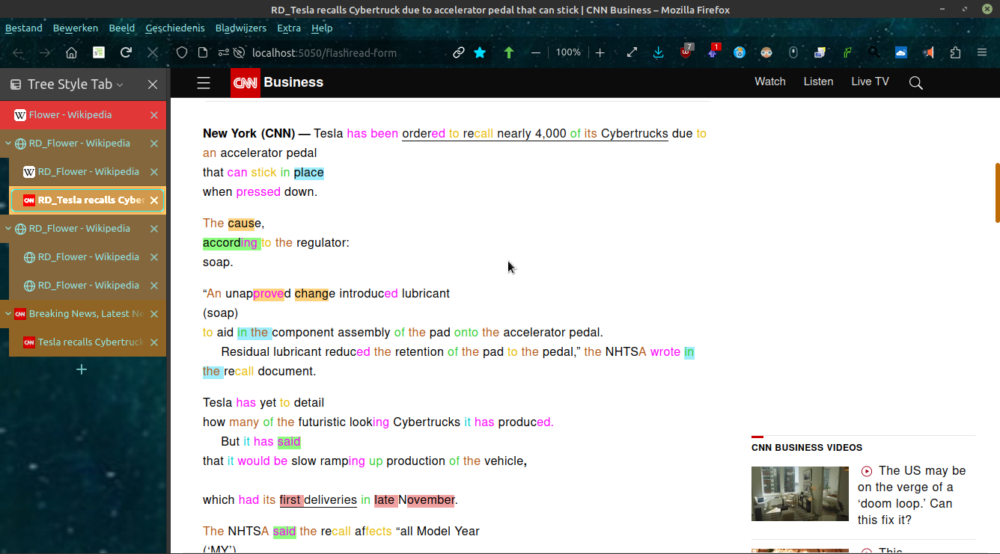
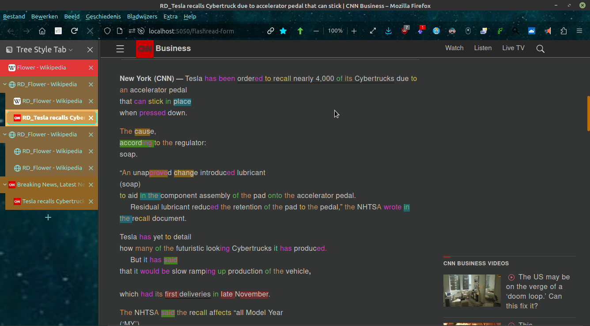
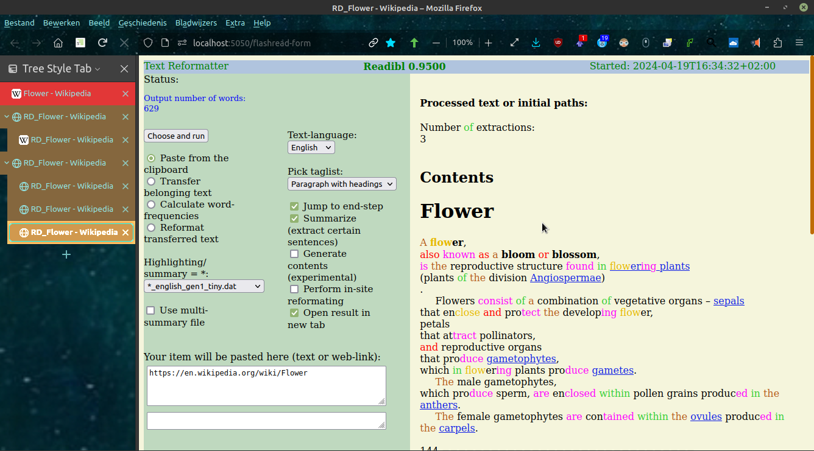
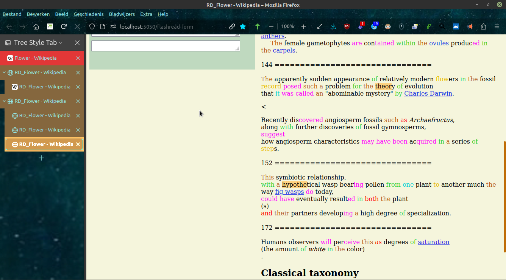
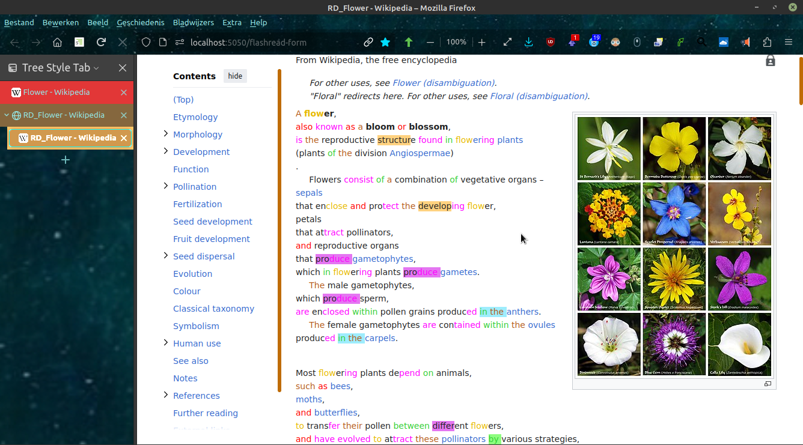

## Readibl Text Reformatter

[See below for more screenshots](#more-screenshots)

[Go to downloadable releases for windows and linux](https://github.com/some-avail/readibl/releases "Downloads for Readible")

[Go to the user-manual / wiki-section](https://github.com/some-avail/readibl/wiki)

[See what is new / what-is-new.txt](mostfiles/what-is-new.txt)

Now Readibl 0.94 for linux available, for windows coming soon.
Readibl Text Reformatter is a program to format normal text or html, so that it is easier to read and process mentally. The program was previously called FlashRead.
The program is written in the language Nim.

#### Installation on linux
- download latest linux-release (tar.gz).
- unpack, place it somewhere in your user-folder, and run the executable "flashread".
- to access the local web-server you just started, type: 
	http://localhost:5050/flashread-form
- the portnumber can now be changed in the configuration-file: settings_flashread.conf

If the paths you see on the webpage dont match the location of the application, adjust and run the linux-script flashread_sh. If the app is started from the dir where the application resides, path-problems can be avoided.

#### Installation on windows
- download latest windows-release (.zip)
- unpack, place it somewhere in your user-folder, and run the executable "flashread".
- start the app preferably from a terminal / powershell to view progress-info.
- to access the local web-server you just started, type: 
	http://localhost:5050/flashread-form

#### Usage
Then you get the user-interface in the browser. From there on you can use the clipboard-contents to either reformat a copied text, or use a copied web-address to process and reformat. Experiment with the switches.
In the config-file "settings_flashread.conf" you can do the following:
- the port-number can be adjusted
- interface-language can be set (besides english there is only dutch for now, but you can make you own language-file *translations.tra).
- possible processing text-languages; only english.dat en dutch.dat exist for now, but you can make your own.

#### Installation by building (for developers)
Developer with knowledge of nim can download the code and do the following:
- install external components:
	- nimclipboard-lib:
		> on linux mint 19 you need to install folowing packages:
		> libx11-xcb-dev and/or xcb
		> in either one of those exists xbc.h, which is needed.
	- moustachu
	- jester

Run the command:
nim c -d:ssl -r flashread.nim

which will compile the code to an executable, which will then be executed. The running program then acts as a local  web-server, which can be invoked from a web-browser, by typing:
http://localhost:5050/flashread-form

Created by Joris Bollen.

<a name="more-screenshots">More screenshots:</a>

Multi-color journalistic highlighting in dark mode (thanks to firefox add-on Dark Reader):

Summarization example (1 of 2) with 3 extractions based a single summary-file:

Summarization example (2 of 2) showing the extractions:

Another multi-coloring example:

*Some older stepped examples:*

Before application of readible reformatting:

After application of readible reformatting:

Word-frequencies can calculated to get a quick impression of the content.

